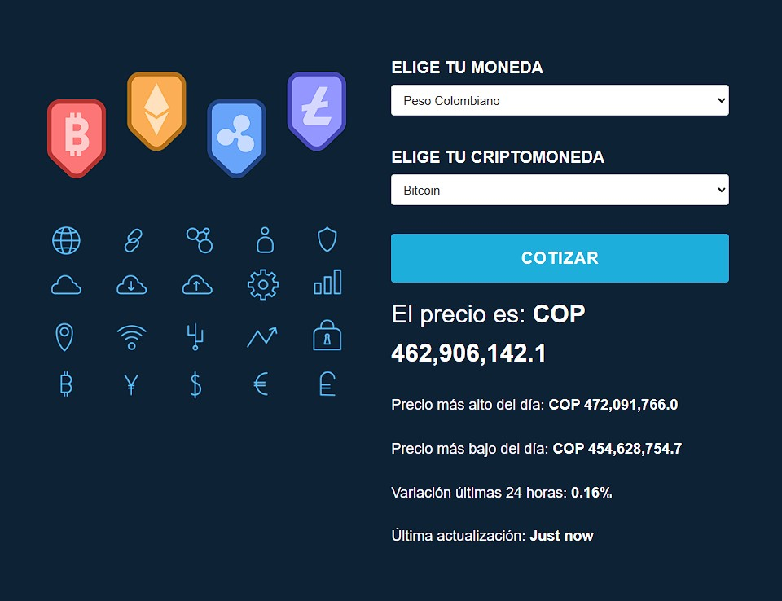

# Cotizador Criptomonedas:

Busca en la moneda seleccionada, el valor de la criptomoneda seleccionada, en la API CoinDesk.

Hecho en vainilla JavaScript, con las siguientes características:

- Validación campos requeridos.
- Utiliza "fetch" para consultas a la API.
- Spinner al hacer consultas.
___

## API

Para usar la API, no es necesario crear cuenta.

[Documentación CoinDesk](https://developers.coindesk.com/documentation/legacy/Price/SingleSymbolPriceEndpoint
)

[Documentación Endpoint 10 criptomonedas más populares](https://developers.coindesk.com/documentation/legacy/Toplists/TopTotalMktCapEndpointFull
)

[Documentación Endpoint valores criptomoneda](https://developers.coindesk.com/documentation/legacy/Price/multipleSymbolsFullPriceEndpoint
)

___

Endpoints usados:

[Endpoint 10 criptomonedas más populares](https://min-api.cryptocompare.com/data/top/mktcapfull?limit=10&tsym=USD
)

[Endpoint valores criptomoneda](https://min-api.cryptocompare.com/data/pricemultifull?fsyms=BTC&tsyms=USD,EUR
)
___

## Screenshots

